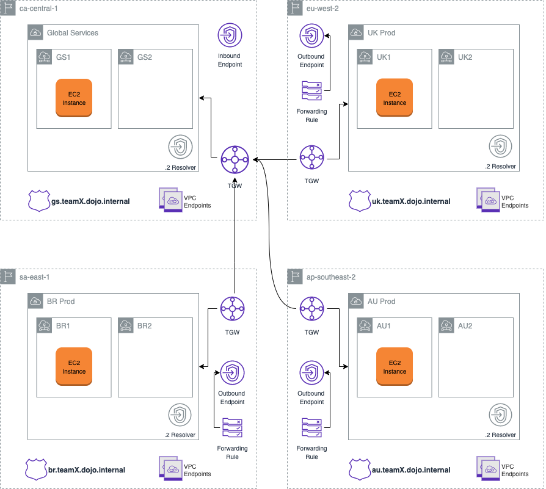
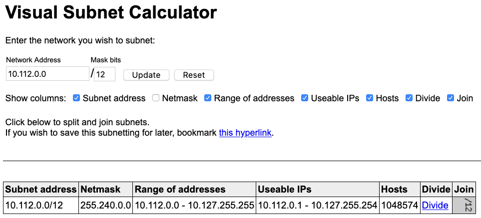
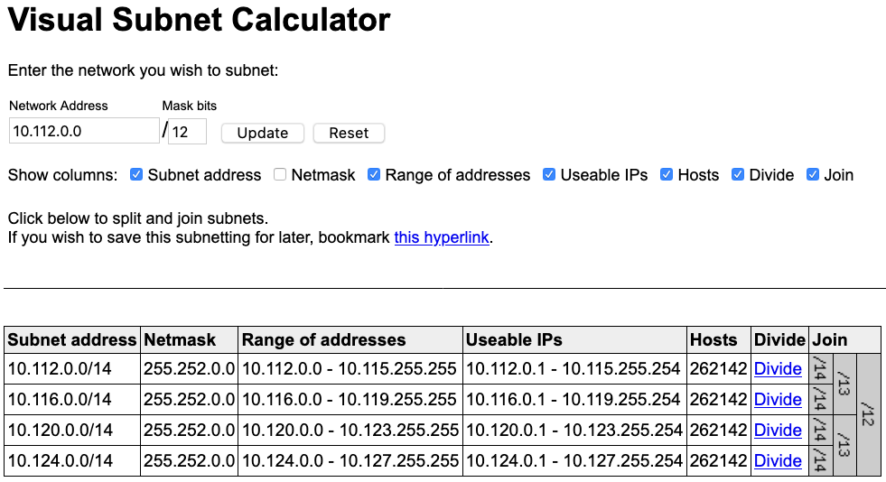
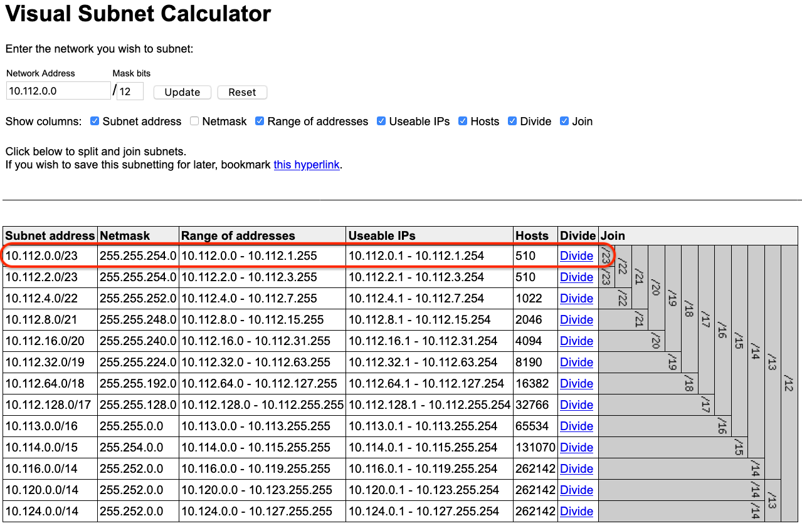
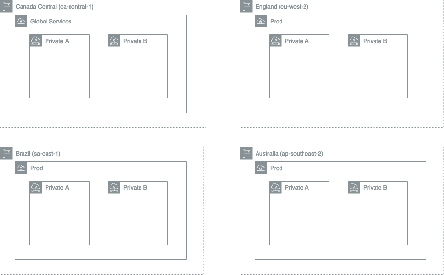

# Deploying a Private Global Transit Network on AWS From Scratch

In this challenge, you will create a private Global Transit Network on AWS to connect four different regions around the globe. In order to do that, you will use a few AWS services, such as the [AWS Transit Gateway](https://aws.amazon.com/transit-gateway/), [Route53 Resolver](https://docs.aws.amazon.com/Route53/latest/DeveloperGuide/resolver-getting-started.html), and [VPC Endpoints](https://docs.aws.amazon.com/vpc/latest/userguide/vpc-endpoints.html).

# Table of Content

- [AWS Services](#aws-services)
- [How Is This Challenge Structured?](#how-is-this-challenge-structured-)
- [Problem Statement](#problem-statement)
- [Architecture](#architecture)
- [Getting Started](#getting-started)
  * [IMPORTANT INFORMATION BEFORE YOU START](#important-information-before-you-start)
  * [Accessing the AWS Console](#accessing-the-aws-console)
- [Building the Solution](#building-the-solution)
  * [Splitting the Global CIDR range into smaller Regional ones (Step 1)](#splitting-the-global-cidr-range-into-smaller-regional-ones-step-1)
    + [Definition of Done](#definition-of-done)
  * [Calculating the Subnet addresses for each one of the VPCs (Step 2)](#calculating-the-subnet-addresses-for-each-one-of-the-vpcs-step-2)
    + [Definition of Done](#definition-of-done-1)
  * [Launching VPCs and Subnets (Step 3)](#launching-vpcs-and-subnets-step-3)
    + [VPCs](#vpcs)
    + [Subnets](#subnets)
    + [Definition of Done](#definition-of-done-2)
  * [Launching EC2 instances and Accessing Them (Step 4)](#launching-ec2-instances-and-accessing-them-step-4)
    + [Creating an IAM Role for the instance](#creating-an-iam-role-for-the-instance)
    + [Creating VPC endpoints](#creating-vpc-endpoints)
    + [Definition of Done](#definition-of-done-3)
  * [Creating Transit Gateways and Inter-Region Peering Connections (Step 5)](#creating-transit-gateways-and-inter-region-peering-connections-step-5)
    + [Definition of Done](#definition-of-done-4)
  * [Architecting and Implementing a Global DNS Solution (Step 6)](#architecting-and-implementing-a-global-dns-solution-step-6)
    + [Requirements](#requirements)
    + [The easiest and nonscalable approach](#the-easiest-and-nonscalable-approach)
    + [A more scalable approach](#a-more-scalable-approach)
    + [Definition of Done](#definition-of-done-5)
- [Conclusion](#conclusion)


# AWS Services

Here's a list of AWS services you will learn in this Dojo:

* [VPC](https://aws.amazon.com/vpc/)
* [AWS Transit Gateway](https://aws.amazon.com/transit-gateway/)
* [Route53 Resolver](https://docs.aws.amazon.com/Route53/latest/DeveloperGuide/resolver-getting-started.html)
* [VPC Endpoints](https://docs.aws.amazon.com/vpc/latest/userguide/vpc-endpoints.html)
* [AWS Systems Manager Session Manager](https://docs.aws.amazon.com/systems-manager/latest/userguide/session-manager.html)

# How Is This Challenge Structured?

The challenge will start with the problem statement and an overview of the solution's architecture, followed by a **Getting Started** section to help you get access to the AWS Console. Then, there will be a number of sections where you will develop a solution for a small piece of the puzzle. And to make sure you've figured out each small piece correctly, there will be **Definition of Done** sections to show you how to test your solution. Finally, you will see some **For Discussion** sections (which are optional) - the goal of these sections is to create a discussion between the team members and the organizers about a certain topic.

# Problem Statement

You were hired by SecretCo (a multinational corporation) to deploy a private Global Transit Network to connect an e-commerce application deployed in three countries (UK, Brazil and Australia) to a log collector server deployed in Canada. The application, which is called *Amazonia*, generates hundreds of megabytes of log data every minute and that need to be securely delivered to the log collector and cannot traverse the Internet at any point in time. In addition, due to region agreements, UK, Brazil and Australia are only allowed to send log data to Canada and never to each other. However, each region should be able to resolve private domains of every other region.

You will be working closely with SecretCo's Chief Networking Officer (CNO).

# Architecture

In this challenge, you will not deploy websites or log collectors. That was just to give you an idea of one of the problems you could solve with a global transit network. Let's see what you will be implementing in this challenge:



In summary:

* The Global Transit Network should be completely **private** and none of the VPCs should have access to the Internet
* UK, Brazil and Australia **should not** be able to communicate with each other. They can only communicate with **Canada** 
* EC2 instances should be accessed through the Systems Manager API endpoint deployed in each VPC
* UK, Brazil and Australia should be able to reach Canada using a private domain (`dojo.internal`)
* Only Transit Gateways can be peered, not VPCs.
* To resolve DNS domains cross-region, Inbound/Outbound Resolvers should be used

# Getting Started

## IMPORTANT INFORMATION BEFORE YOU START

Please read:

* All resources you launch should have their names prefixed with teamX- (e.g. team1-xxxx, team2-xxxx, team3-xxxx - the dash should be included) otherwise you will not be able to launch them
* You will only have access to the following regions: Canada Central, São Paulo, London and Sydney
* The AWS account used in this event will be monitored and any team that attempts to conduct any sort of malicious activity or launch forbidden resources which are not specified in this challenge will have their access to AWS revoked.
* Restrictions apart, have fun! :)

## Accessing the AWS Console

To access the AWS Console, head over to the [AWS Sign-In Page](https://console.aws.amazon.com/) (the Account ID will be provided to you by one of the organizers). Your IAM user name will be teamX, where X is the number of your team (e.g. team1, team2, team3 etc). The password will be provided to you by one of the organizers. Once you log in, make sure you are in the **Canada Central** region to get started.

# Building the Solution

## Splitting the Global CIDR range into smaller Regional ones (Step 1)

Here are the CNO's requirements you received:

* The address of the *entire* network for Amazonia (worldwide) should be: **10.112.0.0/12**. With a `/12` address, you should be able to deploy around 1 million hosts around the world. 
* Each **country** should get **the same number of IP addresses**.
* Canada was chosen as the region that will host the **Global Services** environment where the log collector would be deployed. The Global Services network should have up to **510** IPs available
* UK, Brazil and Australia will host production environments for Amazonia:
    * UK should have up to **8190** IPs
    * Brazil should have up to **4094** IPs
    * And Australia should have up to **16382** IPs

Given the requirements above, let's calculate the network address for the Global Services network together, and then you will calculate the network addresses for the prod environment of the other three regions.

To help us calculate all these addresses, open this [Visual Subnet Calculator](http://www.davidc.net/sites/default/subnets/subnets.html). At the top, under **Network Address** type in `10.112.0.0` and under **Mask bits** type in `/12`. Click **Update**:



A `/12` address would give you a total of 1,048,576 addresses. However, for each network address, [the first and the last IPs cannot be used](http://ladu.htk.tlu.ee/erika/taavi/doc2/network_and_broadcast_address.html). Therefore, as you can see, you would have up to 1,048,574 addresses available.

The CNO also said that each country should get the same number of IPs. Therefore, you will have to get this `/12` address and divide it by 4. To do that, click on the **Divide** button under the **Divide** column, until `10.112.0.0/12` is split into 4 addresses:



Dividing `/12` by 4 would give you 4 `/14` addresses with **262,142** IPs each. These will be the addresses for each country:

* Canada: **10.112.0.0/14**
* UK: **10.116.0.0/14**
* Brazil: **10.120.0.0/14**
* Australia: **10.124.0.0/14**

First, let's focus on calculating the address for Canada's Global Services network.

Given that Canada's regional address will be `10.112.0.0/14`, we will have to split that address until we get to an address which would give us **510** IPs. To do that, click on the **Divide** button until you get a `/23` address:



A `/14` address can be split into multiple `/23` addresses. We're going to pick the first address `10.112.0.0/23` for no particular reason. You could've picked any `/23` address within the `/14` range.

Ok, so now we know that the Global Services VPC that will be deployed in the Canada region will have the address `10.112.0.0/23`.

Now it's your turn! Calculate the network addresses for UK, Brazil and Australia.

### Definition of Done

Once you have all addresses, let one of the organizers know so they can check whether your addresses are correct or not. **Do not proceed without checking with the organizers first as that might impact the final solution.**

## Calculating the Subnet addresses for each one of the VPCs (Step 2)

As part of the solution, you will be deploying a total of 4 VPCs. Each VPC should have 2 **private subnets** (no Internet access). These are the number of IPs that should be available for each subnet:

* Global Services - **126** IPs per subnet
* UK - **4094** IPs per subnet
* Brazil - **62** IPs per subnet
* Australia - one subnet should have **8190** and the other should have **4094** IPs available.

### Definition of Done

Same as Step 1: let one of the organizers know when you've calculated all addresses to make sure you've got the right ones.

## Launching VPCs and Subnets (Step 3)

In this step, you will have to launch all 4 VPCs and their respective subnets. By now, you should have all the VPCs and Subnets addresses. 

### VPCs

Here are the requirements for the name of the VPCs, the regions where you will have to launch them as well as the value for the VPC's **Name tag**:

* Global Services VPC (Canada Central - ca-central-1). **Name tag**: `teamX-global-services`
* UK's Production Environment (London - eu-wests-2). **Name tag**: `teamX-uk-prod`
* Brazil's Production Environment (São Paulo - sa-east-1). **Name tag**: `teamX-br-prod`
* Australia's Production Environment (Sydney - ap-southeast-2). **Name tag**: `teamX-au-prod`

PS1: The `X` in `teamX` refers to your team number (team1, team2, team3 etc).

PS2: **Do not forget to specify your team name in the Name tag of the VPC, otherwise you will not be able to launch it.**

PS3: Set **IPv6 CIDR block** to `No IPv6 CIDR Block` and **Tenancy** to `Default`

### Subnets

For each VPC, create 2 subnets: one in Availability Zone `a` and the other in `b` (all four regions you're working in have AZs `a` and `b`). Here are the **Name tag**s you should use for the subnets, regardless of the region or environment: `teamX-private-a` (for subnets in AZ `a`) and `teamX-private-b` (for subnets in AZ `b`).

### Definition of Done

Take a look at the diagram below to confirm the location of the 4 VPCs and 8 Subnets you deployed:



## Launching EC2 instances and Accessing Them (Step 4)

At the end of the challenge, you will have to ping instances in different regions, so let's start working on that now. 

Deploy 4 identical EC2 instances (one in each VPC you deployed). Here are the requirements for the instances (if there's any configuration you don't see below, use the default):

* **AMI**: Amazon Linux 2 AMI (HVM), SSD Volume Type
* **Instance Type**: t3.nano (**you will only be able to launch nano instances, i.e., t2.nano, t3a.nano and t3.nano**)
* Regardless of the VPC you deploy the instance in, choose any subnet, in any availability zone
* **Auto-assign Public IP**: Disable
* **IAM Role**: None
* **Name tag**: teamX-ping
* Create a new Security Group:
  * **Security Group name**: teamX-ping
  * **Description**: [anything you want]
  * **1 Inbound Rule** 
    * **Type**: All ICMP - IPv4
    * **Protocol**: ICMP
    * **Port Range**: 0 - 65535
    * **Source**: [I'm going to leave it up to you to define the source IP. Just bear in mind that UK, Brazil and Australia can only communicate with Canada and Canada can communicate with all regions, including itself]
  * **There should not be any SSH inbound rule**
* **Do not create an SSH key as you will not need it**. Select **Proceed without a key pair**

Once you launch all 4 instances, it's time to access them. Let's think about this together:

* You don't have public subnets in your VPCs, so you cannot SSH into the instance from your laptop going through the internet
* There's no direct connection between your laptop's network and the VPCs, which means you cannot SSH using a private connection

How can you then access these instances? Using [VPC Endpoints](https://docs.aws.amazon.com/vpc/latest/userguide/vpc-endpoints.html) and the [AWS Systems Manager Session Manager](https://docs.aws.amazon.com/systems-manager/latest/userguide/session-manager.html).

Here's how you can access the instance using the **AWS Systems Manager Session Manager**:

* The instance you launched uses the Amazon Linux 2 AMI. This AMI comes with the AWS Systems Manager Agent (SSM Agent), which is a software that allows Systems Manager to update, manage and configure the instance. As long as your instance is able to communicate with the Systems Manager service, you'd be able to access the instance through the AWS Console (there are other ways you can access the instance, but in this challenge we'll focus on the AWS Console only)
* Since the instance will be making AWS API calls, it will require an IAM Role (we will work on that soon)
* Finally, because the instance does not have Internet access, you will have to set up a [PrivateLink](https://aws.amazon.com/privatelink/) so the network traffic between your instance and Systems Manager goes through the AWS network (and not the Internet).

### Creating an IAM Role for the instance

Let's start by creating an IAM Role. Remember that IAM is a **global** service, so you do not need to create one role per instance. You will create a single role and use that across all the 4 instances. Here are the requirements:

* When creating a role, the **type of trusted entity** should be *AWS service*. More especifically, *EC2* (since the role will be assumed by EC2 instances).
* When selecting the policy, type in **AmazonEC2RoleforSSM** in the search bar. This policy contains all the permissions necessary for the instance to communicate with Systems Manager.
* The name of the role should be `teamX-ssm`

Now assign this role to all 4 instances.

### Creating VPC endpoints

Go to the VPC console and click **Endpoints** on the left panel. Create 2 endpoints for the following services: 	
`com.amazonaws.us-east-1.ssm` and `com.amazonaws.us-east-1.ssmmessages`. Make sure you enable `Private DNS Name`. These endpoints are of type `Interface`, which means you will have to create something else.

### Definition of Done

To make sure you are able to access the instances, do the following for each region:

1. Go to the AWS Systems Manager console and click on Session Manager on the left panel.
1. Click on **Start Session**
1. If you did everything correctly, you should see your instance in the list (`teamX-ping`). Click on **Start session**.
1. A terminal will open in your web browser and you should be able to run basic Linux commands like `ls`.
1. At this point you will not be able to ping other instances because there's no network route. You will work on that in the next step.

## Creating Transit Gateways and Inter-Region Peering Connections (Step 5)

In Step 4, you launched EC2 instances in each region. However, these instances cannot communicate with each other because there's simply no route between the VPCs. Let's work on that now.

Like VPC, Transit Gateway (a.k.a TGW) is not a global resource, which means you will have to create one Transit Gateway per region. In each region, create a TGW following the requirements below:

* Name tag: `teamX-tgw`
* Description: [entirely up to you]
* Amazon side ASN: `64512`
* DNS support: `enable`
* VPN ECMP support: `disable`
* Default route table association: `enable`
* Default route table propagation: `disable`
* Auto accept shared attachments: `disable`

Once you created all 4 TGWs, it's time to create the Transit Gateway Attachments for each one of the VPCs. In each region, create a TGW Attachment following the requirements below:

* Transit Gateway ID: [Select the TGW you created in the same region]
* Attachment type: `VPC`
* Attachment name tag: `teamX-[global-services|uk-prod|br-prod|au-prod]`. E.g. `teamX-global-services`, `teamX-uk-prod`, `teamX-br-prod` (depending in which region the attachment is being created)
* DNS support: `enable`
* IPv6 support: `disable`
* VPC ID: `[Select the VPC for which you're creating this attachment]`

When you created the TGW, you `enabled` **Default route table association**. This means that every VPC Attachment created for each TGW will be automatically added to the TGW's Default Route Table. However, because you `disabled` **Default route table propagation**, when the VPC Attachment was added to the TGW's Default Route Table, a route to this VPC wasn't created. Confusing? Don't worry, we'll set up the routes soon. 

If you want VPCs in different regions to communicate with each other through TGWs, you will need to peer the TGWs. Note that you will only peer TGWs between the following regions:

* Canada and UK
* Canada and Brazil
* Canada and Australia
* **You should not peer UK and Brazil, or UK and Australia or Brazil and Australia. These regions are forbidden from talking to each other.**

Before you peer the TGWs, **copy the ID of the TGW in the Canada region**. Now, create a Transit Gateway Attachment in UK (eu-west-2), Brazil (sa-east-1) and Australia (ap-southeast-2) following the requirements below:

* Transit Gateway ID: [Select the TGW you created in the same region]
* Attachment type: `Peering Connection`
* Attachment name tag: `teamX-peer-ca-[uk|br|au]`. E.g. if peering TGWs in Canada and UK regions (`teamX-peer-ca-uk`), if peering TGWs in Canada and Brazil (`teamX-peer-ca-br`), and so on.
* Account: `My account`
* Region: [eu-west-2 or sa-east-1 or ap-southeast-2]
* Transit Gateway (accepter): [The ID of the TGW in the Canada region]

Go back to the Transit Gateway Attachments in Canada. You should see three attachments where the *State* is **pending acceptance**. For each attachment in that state, select it, click on **Actions** and then **Accept** (this is basically to authorize the TGWs to peer).

At this point, you do not have to worry about adding any TGW Attachment to a TGW Default Route Table. That part is done. Next, you will have to set up all the routes so that UK, Brazil and Australia can talk to Canada.

[Take a look at these 4 examples to understand how to set up the routes for the TGWs](https://docs.aws.amazon.com/vpc/latest/tgw/TGW_Scenarios.html).

Once you're done, don't forget to add the TGWs as destination in each one of the VPC's route tables (*Destination* should be `0.0.0.0/0` and *Target* the TGW ID). 

### Definition of Done

To make sure you correctly peered all TGWs and that the appropriate propagations were created, log in to each one of the 4 EC2 instances and try the following:

* Pinging **Canada** from **UK**, **Brazil** and **Australia** - **Should work!**
* Pinging **UK**, **Brazil** and **Australia** from **Canada** - **Should work!**
* Pinging **UK** from **Brazil** and **Australia** - **Should NOT work!**
* Pinging **Brazil** from **UK** and **Australia** - **Should NOT work!**
* Pinging **Australia** from **UK** and **Brazil** - **Should NOT work!**

## Architecting and Implementing a Global DNS Solution (Step 6)

In this last step of the challenge, you will have to architect and implement a Global DNS solution so that all 4 countries can resolve each other's domains. You will not be given instructions as to how the final architecture will look like, but you will be guided as much as possible.

### Requirements

The **private** domain for each country should follow the naming convention: `[gs|uk|br|au].teamX.dojo.internal`. For example, if `team1` were to create these domains, they'd look like this:

* Global Services - gs.team1.dojo.internal
* UK - uk.team1.dojo.internal
* Brazil - br.team1.dojo.internal
* Australia - au.team1.dojo.internal

If you're new to domains on AWS, for each domain you will create a [Hosted Zone](https://docs.aws.amazon.com/Route53/latest/DeveloperGuide/hosted-zones-working-with.html). If you don't associate any VPC with that Hosted Zone, the domain will be public. If you want the domain to be **private** in your network, you will need to associate at least 1 VPC with it. Fortunately, Hosted Zones are a global service, meaning that you can associate any VPC from any region (no need to create one Hosted Zone per region like you did for VPCs and Transit Gateways).

Before you continue, create each one of the Hosted Zones above.

Now, how would VPCs be able to resolve all these domains?

### The easiest and nonscalable approach

The easiest way to implement a Global DNS solution would be to associate every single VPC to every single Hosted Zone. However, that is certainly not scalable as the number of associations will grow quite rapidly as you create more Hosted Zones and VPCs. Assuming each VPC will have its own Hosted zone, here's an example to show how quickly this number would grow:

* 3 HZs & VPCs: 9 associations
* 10 HZs & VPCs: 100 associations
* 50 HZs & VPCs: 2500 associations
* 1000 HZs & VPCs: 1,000,000 associations

Let's see how we can implement a more scalable solution so that the number of associations doesn't grow as fast. 

### A more scalable approach

To reduce the number of associations, consider the following scenario:

* The Global Services VPC would be associated with all Hosted Zones
* Every other VPC would be associate with ONLY its own Hosted Zone and no other.

Let's run you through the same example again given the new scenario:

* 3 HZs & VPCs: 5 associations
* 10 HZs & VPCs: 19 associations
* 50 HZs & VPCs: 99 associations
* 1000 HZs & VPCs: 1,999 associations

As you can see, the number of associations does not grow as fast. However, to make this work, you will have to use [Route53 Resolvers](https://docs.aws.amazon.com/Route53/latest/DeveloperGuide/resolver-getting-started.html) and [Forwarding Rules](https://docs.aws.amazon.com/Route53/latest/DeveloperGuide/resolver-rules-managing.html#resolver-rules-managing-viewing).

To give you an idea of how to resolve domains across VPCs **in the same region**, [read this article](https://aws.amazon.com/blogs/security/simplify-dns-management-in-a-multiaccount-environment-with-route-53-resolver/) (more specifically, **the third use case**).

The reason why you will not be able to implement the same solution for this challenge is because each one of your VPCs live in a different region. If you create Inbound and Outbound endpoints in the Canada region, for example, you wouldn't be able to associate a Forwarding rule in Sydney to the Outbound endpoint in Canada due to regional boundaries.

With that in mind, it is time for you to wear your super Network Architect hat and architect this solution. If you want to discuss in more details the role of Inbound/Outbound endpoints and Forwarding rules, don't hesitate to reach out to one of the organizers.

Before you start architecting the solution, bear the following in mind:

* The Global Services VPC should be **the central location for DNS resolution**. 
* If a DNS query is originated in Sydney, you will need to forward that request, through the TGWs, to the Global Services VPC
* If you are sending a DNS query from a VPC, you will need an Outbound resolver in that VPC.
* If you are receiving a DNS query in a VPC, you will need an Inbound resolver in that VPC.
* Even though Global Services is the central location for DNS resolution, DNS queries originated in the Global Services VPC also need to be resolved 

### Definition of Done

Before you can test DNS resolution, you will need to create a DNS record in each one of the Hosted Zones you created earlier. For each EC2, create an A record and use the EC2s' private IP address as the **Value** for that record. 

Log in to each one of the EC2 instances you launched earlier and try to run the following command for each one of the domains:

```
dig [gs|uk|br|au].teamX.dojo.internal
```

In the `;; ANSWER SECTION:`, you should see a private IP address. If this IP address you see corresponds to the IP address of one of the EC2 instances you deployed, congrats, your solution worked!

The final test will be to `ping` these domains. However, remember that UK, Brazil and Australia cannot ping each other as there's no network route among them. For example, from UK, you should be able to `ping gs.teamX.dojo.internal` and obtain a response.

# Conclusion

Congratulations on finishing the challenge! Here's a recap of what you learned:

* Calculate network and subnet addresses that expand multiple countries
* Architect and implement global network routes using Transit Gateways
* Set up inter-region peering connections
* Leverage AWS PrivateLink to securely access your private network
* Use Route53 Inbound and Outbound Resolvers to centralize DNS resolution
* Implement Forwarding rules to send DNS resolution requests from all around the globe to a central location

I hope you had fun doing this challenge. See you in the next DevOps Dojo!